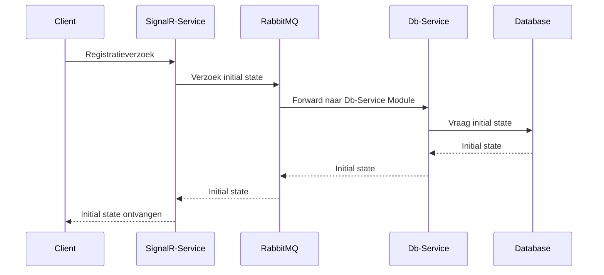

```mermaid
sequenceDiagram
    participant Client
    participant SignalR-Service
    participant RabbitMQ
    participant Db-Service
    participant Database

    Client->>SignalR-Service: Registratieverzoek
    SignalR-Service->>RabbitMQ: Verzoek initial state
    RabbitMQ->>Db-Service: Forward naar Db-Service Module
    Db-Service->>Database: Vraag initial state
    Database-->>Db-Service: Initial state
    Db-Service-->>RabbitMQ: Initial state
    RabbitMQ-->>SignalR-Service: Initial state
    SignalR-Service-->>Client: Initial state ontvangen
```
